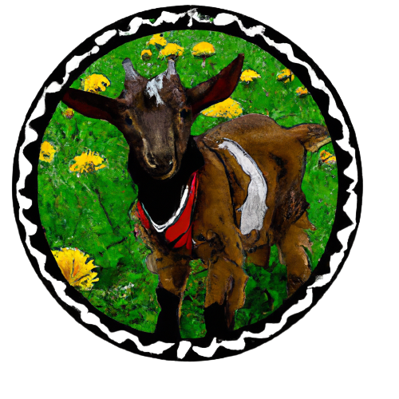

<p align="center" width="100%">

</p>

# Zicklein: A german finetuned instruction LLaMA 🇩🇪

This repository is for a german finetuned version of the LLaMA model. This model is designed for research use only.

## References

> If I have seen further it is by standing on the back of a llama.
> -- <cite>Isaac Newton</cite>

Thanks to the portuguese finetuned version of LLaMA, [Cabrita](https://github.com/22-hours/cabrita), for the inspiration of this project. Also thanks to Meta AI for developing and trainig the base LLaMA model and sparking the era of finetuning, apply for the LLaMA model weights [here](https://ai.facebook.com/blog/large-language-model-llama-meta-ai/).

## Data

A [german-translated version](https://github.com/LEL-A/GerAlpacaDataCleaned) of the [cleaned Stanford Alpaca dataset](https://github.com/gururise/AlpacaDataCleaned) was used. The original Stanford Alpaca dataset is available [here](https://github.com/tatsu-lab/stanford_alpaca/blob/main/alpaca_data.json). The translation was done via the `facebook/wmt19-en-de model` from HuggingFace 🤗 Hub.

More information about how the dataset is configured can be found here: [Stanford Alpaca](https://github.com/tatsu-lab/stanford_alpaca).


## Finetuning

The baseline LLaMA-7b model was finetuned using the LoRA method in 8bit quantization, using parts of the code from [Alpaca Lora](https://github.com/daanelson/alpaca-lora) fork, which makes use of PEFT from HuggingFace 🤗. The finetuning script is located [here](finetune.py). The finetuning was done using a single A100 40GB GPU for 1000 steps.


## Adapter weights download

The finetuned model checkpoints can be downloaded on HuggingFace 🤗:

- [alpaca-lora-7b-german-base-51k](https://huggingface.co/avocardio/alpaca-lora-7b-german-base-51k)


## Example outputs

Stanford Alpaca:
```
In welchen Ländern gibt es Lamas?

Llamas can be found in Bolivia, Peru, Chile, Ecuador, and Argentina.
```

Zicklein:
```
In welchen Ländern gibt es Lamas?

Lamas gibt es in den folgenden Ländern: Argentinien, Bolivien, Brasilien, Chile, Ecuador, Kolumbien, Peru, Uruguay und Venezuela.
```


Stanford Alpaca:
```
Was ist die Rolle des Präsidenten?

The role of the President is to serve as the head of state and the commander-in-chief of the armed forces. The President is responsible for executing the laws of the land, appointing judges and other government officials, and representing the United States in international relations.
```

Zicklein:
```
Was ist die Rolle des Präsidenten?

Die Rolle des Präsidenten besteht darin, die Verfassung der Vereinigten Staaten zu verwalten und die Regierung zu leiten.
```

## Licenses

- Code: [Apache License 2.0](LICENSE)
- Dataset: [CC BY-NC 4.0](https://creativecommons.org/licenses/by-nc/4.0/)
- Model: [Apache License 2.0](LICENSE)
